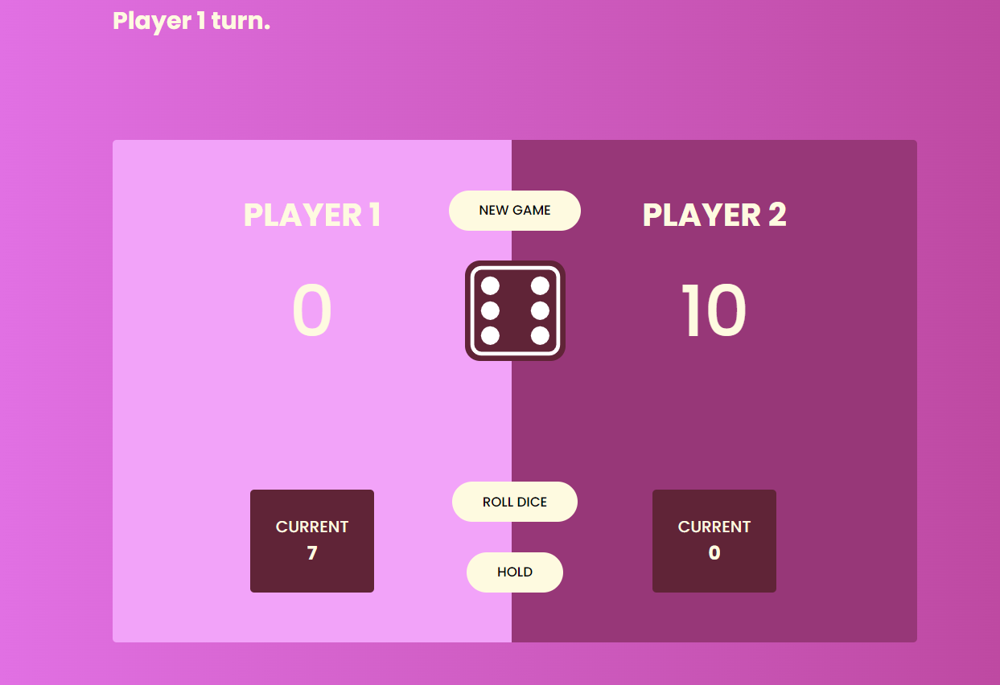

# Dice Game
- Live Site URL: [https://zesty-hamster-26dd37.netlify.app/](https://zesty-hamster-26dd37.netlify.app/)

# Screenshot

# Built with

-HTML
-SCSS
-JAVASCRIPT

# Dice game rules

-when it's a player's turn, he/she must click the roll dice button;
-the number on the dice will be added to the player's current score;
-the player decides if he/she will continue to roll the dice to add points to his current score or
if he/she will click the hold button, adding his current score to the total score(in this case
the other player's turn will follow);
-if a player hits the number 1 on the dice, then he/she lose everything he/she has collected in the current score and it is the other player's turn;
-the first player to reach the total score of 100 points will win;
-to restart the game, click new game button.